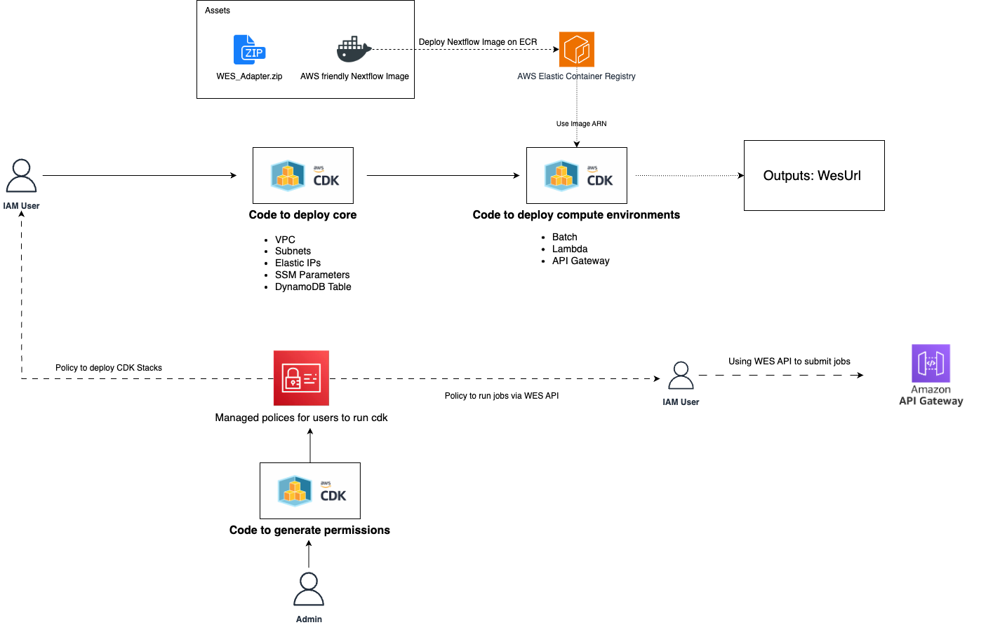

# Nextflow Runner on AWS Infrastructure

Nextflow is a workflow framework and domain-specific language (DSL) for scalable and reproducible scientific workflows.

Nextflow can be run either locally or on a dedicated EC2 instance. This AWS infrastructure is to run Nextflow using AWS Batch in a managed and cost effective fashion.

General Overview of Nextflow Compute Environment via AWS Batch.

The codebase was retrived from [AWS AGC Project](https://github.com/aws/amazon-genomics-cli) and customized, faciliates much freedom to us.
Since the AGC project not maintaining by the AWS team, no updates for latest nextflow versions or supporting nfcore pipelines in the long run.

# Project Directories

This project follows a specific directory structure to organize its files and resources. Here is an overview of the main directories:

## cdk-typescript

The `cdk-typescript` directory contains all the source code files for the CDK. This is where you will find the AWS infrastructure stacks.

## nextflow-engine

The `nextflow-engine` directory used for Nextflow Engine dockerrization, contains an AWS codebuild buildspec.yaml to build image and pushes to ECR.

## wes_adapter

The `wes_adapter` directory contains python code for wes_adapter Lambda.

## docs

The `docs` directory contains documentation and diagrams.

This diagram illustrates the flow of the CDK code and how it works together with other components in the project.

