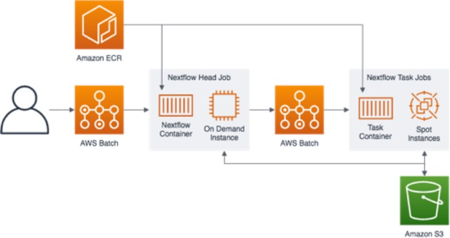

# Nextflow Runner on AWS Infrastructure

This project provides a robust AWS infrastructure for running [Nextflow](https://www.nextflow.io/) workflows using AWS Batch, following the WES API standard. The codebase is adapted from the [AWS AGC Project](https://github.com/aws/amazon-genomics-cli), which is now archived and no longer maintained by AWS. Our focus is on providing a modern, maintainable, and cost-effective solution for running Nextflow pipelines on AWS.

## What is Nextflow?

Nextflow is a workflow framework and domain-specific language (DSL) for scalable and reproducible scientific workflows. It enables running pipelines locally, on-premises, or in the cloud (e.g., on dedicated EC2 instances or AWS Batch).

## Project Overview

This repository provisions all necessary AWS resources to run Nextflow workflows efficiently and securely using AWS Batch. It leverages the WES (Workflow Execution Service) API standard for workflow submission and management.

**General Overview of Nextflow Compute Environment via AWS Batch:**

## Quick Start

### 1. Build and Push Nextflow Docker Image

- Navigate to the `nextflow-engine` directory.
- Use the provided `buildspec.yml` to build a Nextflow Docker image compatible with AWS.
- Push the built image to your AWS ECR repository.

### 2. [Optional] Create WES Adapter Lambda Package

- The `wes_adapter` directory contains Python code for the WES Adapter Lambda function.
- If you need to customize or update the Lambda, build a new `wes_adapter.zip` package.

### 3. Provision AWS Infrastructure with CDK

- The `nextflow-cdk` directory contains all AWS CDK source code for infrastructure provisioning.
- Use AWS CDK to deploy the full stack, including VPC, Batch compute environments, job queues, Lambda functions, and supporting resources.

## Directory Structure

- `nextflow-cdk/` – AWS CDK code for infrastructure provisioning
- `nextflow-engine/` – Dockerization and build scripts for the Nextflow engine
- `wes_adapter/` – Source code for the WES Adapter Lambda function
- `job-orchestrator/` – (Optional) Additional orchestration logic
- `docs/` – Architecture diagrams and documentation

## Additional Notes

- The infrastructure is designed for cost-effectiveness and scalability.
- You can customize compute environments, job queues, and other resources via the CDK code.
- The project supports the latest Nextflow versions and nf-core pipelines.

## References

- [Nextflow Documentation](https://www.nextflow.io/docs/latest/index.html)
- [AWS Batch Documentation](https://docs.aws.amazon.com/batch/)
- [WES API Standard](https://github.com/ga4gh/workflow-execution-service-schemas)
- [Amazon Genomics CLI (AGC) - Archived](https://github.com/aws/amazon-genomics-cli)

---

For detailed setup and customization instructions, please refer to the documentation in the `docs/` directory and comments in the CDK source files.
