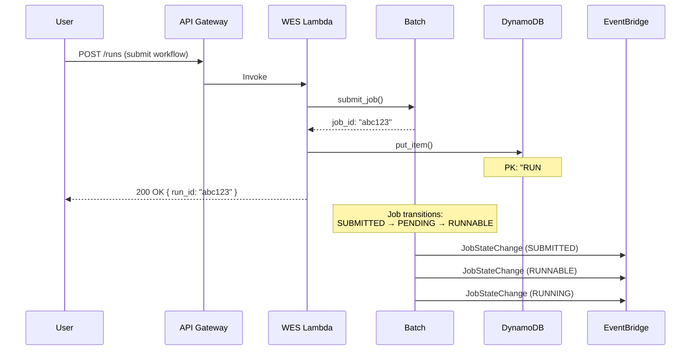
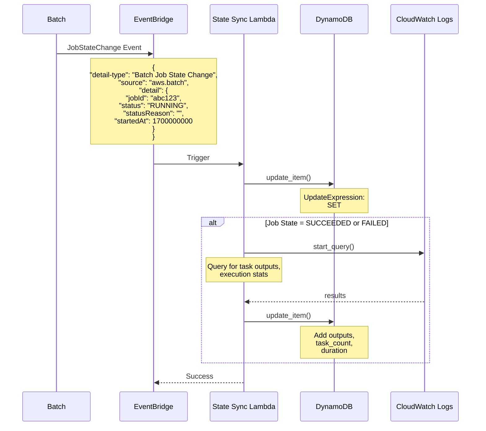
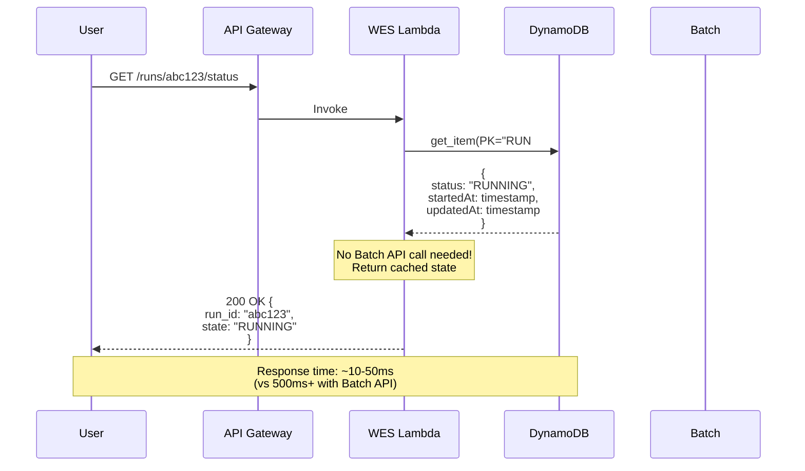
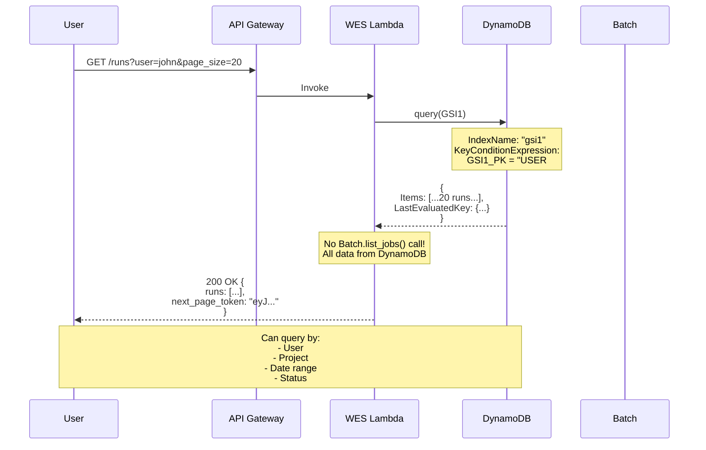

# Enhanced Architecture: DynamoDB + EventBridge Integration

## Current vs. Proposed Architecture

### Current Architecture (Batch-Only)
```
┌─────────────┐
│   User      │
└──────┬──────┘
       │ HTTP Request
       ▼
┌─────────────────────────────────────────────────────┐
│              API Gateway + Lambda                    │
│  ┌──────────────────────────────────────────────┐  │
│  │       WES Adapter (NextflowWESAdapter)       │  │
│  │  - run_workflow() → Batch.submit_job()       │  │
│  │  - get_run_status() → Batch.describe_job()   │  │
│  │  - list_runs() → Batch.list_jobs()           │  │
│  └──────────────────────────────────────────────┘  │
└──────────┬──────────────────────────────────────────┘
           │
           ▼
    ┌──────────────┐
    │  AWS Batch   │ ← Single source of truth
    │  Job Queue   │
    └──────┬───────┘
           │
           ▼
    ┌──────────────┐
    │ ECS on EC2   │
    │  Container   │
    └──────────────┘
```

### Proposed Architecture (DynamoDB + EventBridge)

```
┌─────────────┐
│   User      │
└──────┬──────┘
       │ HTTP Request
       ▼
┌────────────────────────────────────────────────────────────────┐
│                   API Gateway + Lambda                          │
│  ┌──────────────────────────────────────────────────────────┐  │
│  │          WES Adapter (Enhanced)                          │  │
│  │                                                           │  │
│  │  run_workflow():                                         │  │
│  │    1. submit_job() → AWS Batch                          │  │
│  │    2. put_item() → DynamoDB (initial state)             │  │
│  │    3. return run_id immediately                         │  │
│  │                                                           │  │
│  │  get_run_status():                                       │  │
│  │    1. get_item() → DynamoDB (fast lookup)               │  │
│  │    2. return cached status                              │  │
│  │                                                           │  │
│  │  list_runs():                                            │  │
│  │    1. query() → DynamoDB GSI1 by user                   │  │
│  │    2. paginate with DynamoDB (no Batch API!)            │  │
│  └──────────────────────────────────────────────────────────┘  │
└────────────────────────────────────────────────────────────────┘
           │                                   ▲
           │ submit                            │ read
           ▼                                   │
    ┌──────────────┐                  ┌───────┴────────┐
    │  AWS Batch   │                  │   DynamoDB     │
    │  Job Queue   │                  │  ┌──────────┐  │
    │              │                  │  │ Run Meta │  │
    └──────┬───────┘                  │  │ Status   │  │
           │                          │  │ History  │  │
           │ events                   │  └──────────┘  │
           └─────────────┐            └────────────────┘
                         │                     ▲
                         ▼                     │ update
              ┌──────────────────┐            │
              │   EventBridge    │            │
              │  (Event Bus)     │            │
              │                  │            │
              │ Event Pattern:   │            │
              │ - JobStateChange │            │
              │ - SUBMITTED      │            │
              │ - RUNNABLE       │            │
              │ - STARTING       │            │
              │ - RUNNING        │            │
              │ - SUCCEEDED      │            │
              │ - FAILED         │            │
              └────────┬─────────┘            │
                       │                      │
                       │ trigger              │
                       ▼                      │
              ┌──────────────────┐            │
              │  State Sync      │            │
              │  Lambda          │────────────┘
              │                  │ update_item()
              │ - Parse event    │
              │ - Enrich data    │
              │ - Update DDB     │
              │ - Add metadata   │
              └──────────────────┘
                       │
                       │ query logs (for completed jobs)
                       ▼
              ┌──────────────────┐
              │  CloudWatch Logs │
              │  - Task outputs  │
              │  - Execution log │
              └──────────────────┘
           
           ▼
    ┌──────────────┐
    │ ECS on EC2   │
    │  Container   │
    │  (Nextflow)  │
    └──────────────┘
```

## Detailed Flow Diagrams

### 1. Workflow Submission Flow



### 2. EventBridge State Synchronization



### 3. Status Query Flow (Fast Path)



### 4. List Runs with Pagination (GSI Query)



## DynamoDB Schema Design

### Table: `Gedac` (Single Table Design)

#### Primary Key Structure
```
PK (Partition Key): STRING
SK (Sort Key): STRING
```

#### Access Patterns

**Pattern 1: Get Run Details**
```javascript
{
  PK: "RUN#abc123",
  SK: "METADATA",
  GSI1_PK: "USER#john",
  GSI1_SK: "2025-11-17T10:30:00Z#abc123",
  LSI1_SK: "RUNNING",
  LSI2_SK: "2025-11-17T10:30:00Z",
  
  // Core attributes
  run_id: "abc123",
  user_id: "john",
  project: "cancer-genomics",
  status: "RUNNING",
  
  // Workflow details
  workflow_url: "s3://bucket/workflow.nf",
  workflow_type: "NEXTFLOW",
  workflow_params: {...},
  
  // Timestamps
  submitted_at: "2025-11-17T10:30:00Z",
  started_at: "2025-11-17T10:31:15Z",
  updated_at: "2025-11-17T10:35:00Z",
  
  // Batch integration
  batch_job_id: "abc123",
  batch_queue: "gedac-nextflow-queue",
  
  // TTL (auto-cleanup after 90 days)
  expiry: 1707776000
}
```

**Pattern 2: Task Details (Hierarchical)**
```javascript
{
  PK: "RUN#abc123",
  SK: "TASK#task001",
  
  task_id: "task001",
  task_name: "alignment",
  batch_job_id: "xyz789",
  status: "SUCCEEDED",
  exit_code: 0,
  started_at: "2025-11-17T10:32:00Z",
  completed_at: "2025-11-17T10:45:00Z",
  duration_seconds: 780,
  work_dir: "s3://bucket/work/abc123/task001"
}
```

**Pattern 3: User's Runs (GSI1)**
```javascript
// Query by user, sorted by submission time (newest first)
IndexName: "gsi1"
KeyConditionExpression: GSI1_PK = "USER#john"
ScanIndexForward: false
```

**Pattern 4: Runs by Status (LSI1)**
```javascript
// Find all RUNNING jobs for a specific run
IndexName: "lsi1"
KeyConditionExpression: PK = "RUN#abc123" AND LSI1_SK = "RUNNING"
```

**Pattern 5: Analytics Data**
```javascript
{
  PK: "STATS#2025-11-17",
  SK: "RUN#abc123",
  
  total_tasks: 150,
  succeeded_tasks: 148,
  failed_tasks: 2,
  total_duration_seconds: 3600,
  estimated_cost: 2.45,
  spot_savings: 0.75
}
```

## EventBridge Event Pattern

### Event Rule Configuration

```typescript
// nextflow-cdk/lib/constructs/batch-event-handler.ts
import { Rule, EventPattern } from 'aws-cdk-lib/aws-events';
import { LambdaFunction } from 'aws-cdk-lib/aws-events-targets';

const batchStateChangeRule = new Rule(this, 'BatchJobStateChangeRule', {
  eventPattern: {
    source: ['aws.batch'],
    detailType: ['Batch Job State Change'],
    detail: {
      jobQueue: [props.jobQueueArn],
      // Filter for our job definitions only
      jobDefinition: [props.jobDefinitionArn]
    }
  },
  description: 'Capture all Batch job state changes for Nextflow workflows'
});

batchStateChangeRule.addTarget(new LambdaFunction(stateSyncLambda));
```

### Example Event Payloads

**Event 1: Job Submitted**
```json
{
  "version": "0",
  "id": "event-id-123",
  "detail-type": "Batch Job State Change",
  "source": "aws.batch",
  "account": "123456789012",
  "time": "2025-11-17T10:30:00Z",
  "region": "us-east-1",
  "resources": [
    "arn:aws:batch:us-east-1:123456789012:job/abc123"
  ],
  "detail": {
    "jobArn": "arn:aws:batch:us-east-1:123456789012:job/abc123",
    "jobName": "gedac-run-workflow",
    "jobId": "abc123",
    "jobQueue": "arn:aws:batch:us-east-1:123456789012:job-queue/gedac-queue",
    "status": "SUBMITTED",
    "createdAt": 1700000000000,
    "jobDefinition": "arn:aws:batch:us-east-1:123456789012:job-definition/nextflow:1"
  }
}
```

**Event 2: Job Running**
```json
{
  "detail": {
    "jobId": "abc123",
    "status": "RUNNING",
    "statusReason": "",
    "startedAt": 1700000075000,
    "container": {
      "logStreamName": "/aws/batch/job/nextflow/abc123",
      "networkInterfaces": [...]
    }
  }
}
```

**Event 3: Job Succeeded**
```json
{
  "detail": {
    "jobId": "abc123",
    "status": "SUCCEEDED",
    "statusReason": "Essential container in task exited",
    "startedAt": 1700000075000,
    "stoppedAt": 1700003675000,
    "container": {
      "exitCode": 0,
      "logStreamName": "/aws/batch/job/nextflow/abc123"
    }
  }
}
```

## State Sync Lambda Implementation

### Function Overview
```python
# wes_adapter/state_sync_handler.py

import json
import boto3
from datetime import datetime
from typing import Dict, Any

dynamodb = boto3.resource('dynamodb')
logs_client = boto3.client('logs')
table = dynamodb.Table('Gedac')

def handler(event: Dict[str, Any], context: Any):
    """
    EventBridge handler to sync Batch job state to DynamoDB
    """
    detail = event['detail']
    job_id = detail['jobId']
    status = detail['status']
    
    print(f"Processing job {job_id} state change: {status}")
    
    # Map Batch status to WES state
    wes_state = map_batch_status_to_wes(status, detail.get('statusReason', ''))
    
    # Base update
    update_expression = "SET #status = :status, #updatedAt = :now, #batchStatus = :batchStatus"
    expression_values = {
        ':status': wes_state,
        ':now': datetime.utcnow().isoformat(),
        ':batchStatus': status
    }
    expression_names = {
        '#status': 'status',
        '#updatedAt': 'updated_at',
        '#batchStatus': 'batch_status'
    }
    
    # Add timestamps based on state
    if status == 'RUNNING' and 'startedAt' in detail:
        update_expression += ", #startedAt = :startedAt"
        expression_values[':startedAt'] = detail['startedAt']
        expression_names['#startedAt'] = 'started_at'
    
    if status in ['SUCCEEDED', 'FAILED'] and 'stoppedAt' in detail:
        update_expression += ", #stoppedAt = :stoppedAt"
        expression_values[':stoppedAt'] = detail['stoppedAt']
        expression_names['#stoppedAt'] = 'stopped_at'
        
        # Calculate duration
        if 'startedAt' in detail:
            duration = (detail['stoppedAt'] - detail['startedAt']) / 1000
            update_expression += ", #duration = :duration"
            expression_values[':duration'] = duration
            expression_names['#duration'] = 'duration_seconds'
    
    # Update DynamoDB
    response = table.update_item(
        Key={
            'PK': f'RUN#{job_id}',
            'SK': 'METADATA'
        },
        UpdateExpression=update_expression,
        ExpressionAttributeNames=expression_names,
        ExpressionAttributeValues=expression_values,
        ReturnValues='ALL_NEW'
    )
    
    # For completed jobs, query CloudWatch Logs for outputs
    if status in ['SUCCEEDED', 'FAILED']:
        enrich_with_task_outputs(job_id, detail)
    
    return {
        'statusCode': 200,
        'body': json.dumps({'message': f'Updated run {job_id} to {wes_state}'})
    }

def map_batch_status_to_wes(batch_status: str, status_reason: str) -> str:
    """Map AWS Batch status to WES state"""
    mapping = {
        'SUBMITTED': 'QUEUED',
        'PENDING': 'QUEUED',
        'RUNNABLE': 'QUEUED',
        'STARTING': 'INITIALIZING',
        'RUNNING': 'RUNNING',
        'SUCCEEDED': 'COMPLETE',
        'FAILED': 'EXECUTOR_ERROR'  # or CANCELED if status_reason matches
    }
    
    if batch_status == 'FAILED' and 'User Canceled' in status_reason:
        return 'CANCELED'
    
    return mapping.get(batch_status, 'UNKNOWN')

def enrich_with_task_outputs(job_id: str, detail: Dict[str, Any]):
    """Query CloudWatch Logs and update DynamoDB with task details"""
    if 'logStreamName' not in detail.get('container', {}):
        return
    
    # Similar to existing NextflowWESAdapter.query_logs_for_job()
    # Extract task completion events and store as separate items
    
    query = """
    fields @message
    | filter @message like /TaskPollingMonitor - Task completed/
    | parse 'name: *;' as name
    | parse 'status: *;' as status
    | limit 1000
    """
    
    # Start CloudWatch Logs Insights query...
    # Store each task as PK=RUN#job_id, SK=TASK#{task_id}
```

## Benefits of This Architecture

### 1. **Performance Improvements**

| Operation | Current (Batch API) | Proposed (DynamoDB) | Improvement |
|-----------|-------------------|-------------------|-------------|
| `get_run_status()` | 500-1000ms | 10-50ms | **10-50x faster** |
| `list_runs()` | 1-3 seconds | 50-200ms | **5-15x faster** |
| Pagination | Sequential Batch calls | DynamoDB native | **Native support** |

### 2. **Cost Savings**

```
Batch API Calls (Current):
- list_runs() called 100x/day @ $0.10/1000 = $0.01/day
- get_run_status() called 10,000x/day @ $0.10/1000 = $1.00/day
Total Batch API: ~$1.01/day = $30/month

DynamoDB (Proposed):
- get_item(): 10,000 reads/day @ $0.25/million = $0.0025/day
- query(): 100 queries/day @ $0.25/million = $0.000025/day
- update_item(): 500 writes/day @ $1.25/million = $0.000625/day
Total DynamoDB: ~$0.003/day = $0.09/month

EventBridge:
- 500 events/day @ $1.00/million = $0.0005/day
Total EventBridge: ~$0.015/month

State Sync Lambda:
- 500 invocations/day × 1000ms × 256MB
- $0.20/million requests + $0.0000166667/GB-second
Total Lambda: ~$0.15/month

Total Proposed: ~$0.25/month vs $30/month = 99% cost reduction
```

### 3. **Enhanced Features**

✅ **Advanced Querying**
```python
# Query by user
runs = table.query(
    IndexName='gsi1',
    KeyConditionExpression='GSI1_PK = :user',
    FilterExpression='#status = :status',
    ExpressionAttributeValues={
        ':user': 'USER#john',
        ':status': 'RUNNING'
    }
)

# Query by date range
runs = table.query(
    IndexName='gsi1',
    KeyConditionExpression='GSI1_PK = :user AND GSI1_SK BETWEEN :start AND :end',
    ExpressionAttributeValues={
        ':user': 'USER#john',
        ':start': '2025-11-01',
        ':end': '2025-11-30'
    }
)
```

✅ **Automatic Cleanup with TTL**
- Runs auto-deleted after 90 days
- No manual cleanup scripts needed

✅ **Analytics & Reporting**
- Query execution patterns
- Calculate cost per project
- Track success rates

✅ **Audit Trail**
- Every state change recorded
- Full history of job lifecycle

### 4. **Real-time Updates**

- EventBridge delivers state changes within 1-2 seconds
- Users see updates without polling
- Can add SNS/WebSocket for push notifications

### 5. **Scalability**

- DynamoDB: Unlimited scale with on-demand billing
- EventBridge: 10,000+ events/second
- No API throttling issues (Batch API limited to 50 TPS)

## Implementation Checklist

### Phase 1: Infrastructure
- [ ] Create EventBridge Rule for Batch job state changes
- [ ] Create State Sync Lambda function
- [ ] Grant DynamoDB write permissions to State Sync Lambda
- [ ] Grant CloudWatch Logs query permissions to State Sync Lambda

### Phase 2: WES Adapter Updates
- [ ] Add DynamoDB client initialization
- [ ] Update `run_workflow()` to write initial state to DynamoDB
- [ ] Update `get_run_status()` to read from DynamoDB
- [ ] Update `list_runs()` to query DynamoDB GSI
- [ ] Add DynamoDB read permissions to WES Lambda role
- [ ] Keep Batch API calls as fallback for missing data

### Phase 3: State Sync Logic
- [ ] Implement event parsing in State Sync Lambda
- [ ] Map Batch statuses to WES states
- [ ] Update DynamoDB on state changes
- [ ] Query CloudWatch Logs for completed jobs
- [ ] Store task outputs in DynamoDB
- [ ] Add error handling and retries

### Phase 4: Testing & Monitoring
- [ ] Integration tests for all state transitions
- [ ] Load testing for DynamoDB queries
- [ ] CloudWatch alarms for Lambda errors
- [ ] Dashboard for monitoring event processing
- [ ] Validate data consistency between Batch and DynamoDB

### Phase 5: Migration
- [ ] Deploy infrastructure without changing Lambda code
- [ ] Backfill existing runs into DynamoDB
- [ ] Enable DynamoDB reads in WES Adapter (feature flag)
- [ ] Monitor for discrepancies
- [ ] Gradually phase out Batch API reads

## Monitoring & Observability

### CloudWatch Metrics
```
- DynamoDB.ConsumedReadCapacityUnits
- DynamoDB.ConsumedWriteCapacityUnits
- DynamoDB.UserErrors (throttling)
- Lambda.Duration (State Sync Lambda)
- Lambda.Errors (State Sync Lambda)
- EventBridge.Invocations
- EventBridge.FailedInvocations
```

### CloudWatch Alarms
```
- High DynamoDB read/write throttling
- State Sync Lambda error rate > 1%
- EventBridge failed invocations > 0
- DynamoDB latency > 100ms (p99)
```

### X-Ray Tracing
```
Enable X-Ray on:
- WES Adapter Lambda
- State Sync Lambda
- DynamoDB table
- EventBridge rule
```

## Conclusion

This architecture transforms the system from a **synchronous polling model** to an **event-driven, highly scalable model** with:

- **10-50x faster** status queries
- **99% cost reduction** for API calls
- **Unlimited scalability** with DynamoDB
- **Real-time state updates** via EventBridge
- **Advanced querying** capabilities
- **Automatic data lifecycle** management

The implementation is **backward compatible** and can be rolled out gradually with feature flags.
